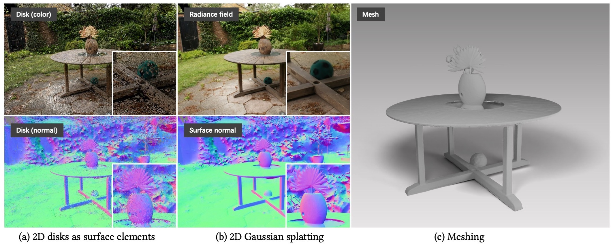

# 2D Gaussian Splatting for Geometrically Accurate Radiance Fields

[Project page](https://surfsplatting.github.io/) | [Paper](https://arxiv.org/pdf/2403.17888) | [Video](https://www.youtube.com/watch?v=oaHCtB6yiKU) | [Surfel Rasterizer (CUDA)](https://github.com/hbb1/diff-surfel-rasterization) | [Surfel Rasterizer (Python)](https://colab.research.google.com/drive/1qoclD7HJ3-o0O1R8cvV3PxLhoDCMsH8W?usp=sharing) | [DTU+COLMAP (3.5GB)](https://drive.google.com/drive/folders/1SJFgt8qhQomHX55Q4xSvYE2C6-8tFll9) | [SIBR Viewer Pre-built for Windows](https://drive.google.com/file/d/1DRFrtFUfz27QvQKOWbYXbRS2o2eSgaUT/view?usp=sharing) | [Web Viewer](https://github.com/mkkellogg/GaussianSplats3D) <br>



This repo contains the official implementation for the paper "2D Gaussian Splatting for Geometrically Accurate Radiance Fields". Our work represents a scene with a set of 2D oriented disks (surface elements) and rasterizes the surfels with [perspective correct differentiable raseterization](https://colab.research.google.com/drive/1qoclD7HJ3-o0O1R8cvV3PxLhoDCMsH8W?usp=sharing). Our work also develops regularizations that enhance the reconstruction quality. We also devise meshing approaches for Gaussian splatting.


## ⭐ New Features 
- 2024/07/20: Web-based viewer [GaussianSplats3D](https://github.com/mkkellogg/GaussianSplats3D) also supports 2DGS. Thanks to [Mark Kellogg](https://github.com/mkkellogg)
- 2024/07/19: [Colab Notebook](https://github.com/atakan-topaloglu/2d_gaussian_splatting_colab) is supported! Thanks to [atakan-topaloglu](https://github.com/atakan-topaloglu)
- 2024/06/10: [SIBR Viewer](https://github.com/RongLiu-Leo/2d-gaussian-splatting) is supported!
- 2024/06/05: [Remote Viewer](https://github.com/hwanhuh/2D-GS-Viser-Viewer) based on Viser is supported! Thanks to [HwanHeo](https://github.com/hwanhuh).
- 2024/05/30:  Fixed a bug related to unbounded meshing. The foreground mesh quality should now be consistent with the bounded mesh.
- 2024/05/17: Improve training speed by 30%~40% through the [cuda operator fusing](https://github.com/hbb1/diff-surfel-rasterization/pull/7). Please update the diff-surfel-rasterization submodule if you have already installed it. 
    ```bash
    git submodule update --remote  
    pip install submodules/diff-surfel-rasterization
    ```
- 2024/05/05: Important updates - Now our algorithm supports **unbounded mesh extraction**!
Our key idea is to contract the space into a sphere and then perform **adaptive TSDF truncation**. 


## SIBR Viewer


https://github.com/RongLiu-Leo/2d-gaussian-splatting/assets/102014841/b75dd9a7-e3ee-4666-99ff-8c9121ff66dc


The Pre-built Viewer for Windows can be found [here](https://drive.google.com/file/d/1DRFrtFUfz27QvQKOWbYXbRS2o2eSgaUT/view?usp=sharing). If you use Ubuntu or want to check the viewer usage, please refer to [GS Monitor](https://github.com/RongLiu-Leo/Gaussian-Splatting-Monitor).
### How to use
Firstly open the viewer, 
```shell
<path to downloaded/compiled viewer>/bin/SIBR_remoteGaussian_app_rwdi
```
and then
```shell
# Monitor the training process
python train.py -s <path to COLMAP or NeRF Synthetic dataset> 
# View the trained model
python view.py -s <path to COLMAP or NeRF Synthetic dataset> -m <path to trained model> 
```

## Installation

```bash
# download
git clone https://github.com/hbb1/2d-gaussian-splatting.git --recursive

# if you have an environment used for 3dgs, use it
# if not, create a new environment
conda env create --file environment.yml
conda activate surfel_splatting
```
## Training
To train a scene, simply use
```bash
python train.py -s <path to COLMAP or NeRF Synthetic dataset>
```
Commandline arguments for regularizations
```bash
--lambda_normal  # hyperparameter for normal consistency
--lambda_distortion # hyperparameter for depth distortion
--depth_ratio # 0 for mean depth and 1 for median depth, 0 works for most cases
```
**Tips for adjusting the parameters on your own dataset:**
- For unbounded/large scenes, we suggest using mean depth, i.e., ``depth_ratio=0``,  for less "disk-aliasing" artifacts.

## Testing
### Bounded Mesh Extraction
To export a mesh within a bounded volume, simply use
```bash
python render.py -m <path to pre-trained model> -s <path to COLMAP dataset> 
```
Commandline arguments you should adjust accordingly for meshing for bounded TSDF fusion, use
```bash
--depth_ratio # 0 for mean depth and 1 for median depth
--voxel_size # voxel size
--depth_trunc # depth truncation
```
If these arguments are not specified, the script will automatically estimate them using the camera information.
### Unbounded Mesh Extraction
To export a mesh with an arbitrary size, we devised an unbounded TSDF fusion with space contraction and adaptive truncation.
```bash
python render.py -m <path to pre-trained model> -s <path to COLMAP dataset> --mesh_res 1024
```

## Quick Examples
Assuming you have downloaded [MipNeRF360](https://jonbarron.info/mipnerf360/), simply use
```bash
python train.py -s <path to m360>/<garden> -m output/m360/garden
# use our unbounded mesh extraction!!
python render.py -s <path to m360>/<garden> -m output/m360/garden --unbounded --skip_test --skip_train --mesh_res 1024
# or use the bounded mesh extraction if you focus on foreground
python render.py -s <path to m360>/<garden> -m output/m360/garden --skip_test --skip_train --mesh_res 1024
```
If you have downloaded the [DTU dataset](https://drive.google.com/drive/folders/1SJFgt8qhQomHX55Q4xSvYE2C6-8tFll9), you can use
```bash
python train.py -s <path to dtu>/<scan105> -m output/date/scan105 -r 2 --depth_ratio 1
python render.py -r 2 --depth_ratio 1 --skip_test --skip_train
```
**Custom Dataset**: We use the same COLMAP loader as 3DGS, you can prepare your data following [here](https://github.com/graphdeco-inria/gaussian-splatting?tab=readme-ov-file#processing-your-own-scenes). 

## Full evaluation
We provide scripts to evaluate our method of novel view synthesis and geometric reconstruction.
<details>
<summary><span style="font-weight: bold;">Explanation of Performance Differences to the Paper</span></summary>

We have re-implemented the repository for improved efficiency, which has slightly impacted performance compared to the original paper. Two factors have influenced this change:

- 📈 We fixed some minor bugs, such as a half-pixel shift in TSDF fusion, resulting in improved geometry reconstruction.

- 📉 We removed the gradient of the low-pass filter used for densification, which reduces the number of Gaussians. As a result, the PSNR has slightly dropped, but we believe this trade-off is worthwhile for real-world applications.

You can report either the numbers from the paper or from this implementation, as long as they are discussed in a comparable setting.
</details>

#### Novel View Synthesis
For novel view synthesis on [MipNeRF360](https://jonbarron.info/mipnerf360/) (which also works for other colmap datasets), use
```bash
python scripts/mipnerf_eval.py -m60 <path to the MipNeRF360 dataset>
```
We provide <a> Evaluation Results (Pretrained, Images)</a>. 
<details>
<summary><span style="font-weight: bold;">Table Results</span></summary>

</details>

#### Geometry reconstruction
For geometry reconstruction on DTU dataset, please download the preprocessed data from [Drive](https://drive.google.com/drive/folders/1SJFgt8qhQomHX55Q4xSvYE2C6-8tFll9) or [Hugging Face](https://huggingface.co/datasets/dylanebert/2DGS). You also need to download the ground truth [DTU point cloud](https://roboimagedata.compute.dtu.dk/?page_id=36). 
```bash
python scripts/dtu_eval.py --dtu <path to the preprocessed DTU dataset>   \
     --DTU_Official <path to the official DTU dataset>
```
We provide <a> Evaluation Results (Pretrained, Meshes)</a>. 
<details>
<summary><span style="font-weight: bold;">Table Results</span></summary>

Chamfer distance on DTU dataset (lower is better)

|   | 24   | 37   | 40   | 55   | 63   | 65   | 69   | 83   | 97   | 105  | 106  | 110  | 114  | 118  | 122  | Mean |
|----------|------|------|------|------|------|------|------|------|------|------|------|------|------|------|------|------|
| Paper    | 0.48 | 0.91 | 0.39 | 0.39 | 1.01 | 0.83 | 0.81 | 1.36 | 1.27 | 0.76 | 0.70 | 1.40 | 0.40 | 0.76 | 0.52 | 0.80 |
| Reproduce | 0.46 | 0.80 | 0.33 | 0.37 | 0.95 | 0.86 | 0.80 | 1.25 | 1.24 | 0.67 | 0.67 | 1.24 | 0.39 | 0.64 | 0.47 | 0.74 |
</details>
<br>

For geometry reconstruction on TnT dataset, please download the preprocessed [TnT_data](https://huggingface.co/datasets/ZehaoYu/gaussian-opacity-fields/tree/main). You also need to download the ground truth [TnT_GT](https://www.tanksandtemples.org/download/), including ground truth point cloud, alignments and cropfiles.

**Due to historical issue, you should use open3d==0.10.0 for evaluating TNT.**
```bash
# use open3d 0.18.0, skip metrics
python scripts/tnt_eval.py --TNT_data <path to the preprocessed TNT dataset>   \
     --TNT_GT <path to the official TNT evaluation dataset> --skip_metrics

# use open3d 0.10.0, skip traing and rendering
python scripts/tnt_eval.py --TNT_data <path to the preprocessed TNT dataset>   \
     --TNT_GT <path to the official TNT evaluation dataset> --skip_training --skip_rendering
```
We provide <a> Evaluation Results (Pretrained, Meshes)</a>. 
<details>
<summary><span style="font-weight: bold;">Table Results</span></summary>

F1 scores on TnT dataset (higher is better)

|    | Barn   | Caterpillar | Ignatius | Truck  | Meetingroom | Courthouse | Mean | 
|--------|--------|-------------|----------|--------|-------------|------------|------------|
| Reproduce | 0.41  | 0.23      | 0.51   | 0.45 | 0.17      | 0.15      | 0.32 |
</details>
<br>


## FAQ
- **Training does not converge.**  If your camera's principal point does not lie at the image center, you may experience convergence issues. Our code only supports the ideal pinhole camera format, so you may need to make some modifications. Please follow the instructions provided [here](https://github.com/graphdeco-inria/gaussian-splatting/issues/144#issuecomment-1938504456) to make the necessary changes. We have also modified the rasterizer in the latest [commit](https://github.com/hbb1/diff-surfel-rasterization/pull/6) to support data accepted by 3DGS. To avoid further issues, please update to the latest commit.

- **No mesh / Broken mesh.** When using the *Bounded mesh extraction* mode, it is necessary to adjust the `depth_trunc` parameter to perform TSDF fusion to extract meshes. On the other hand, *Unbounded mesh extraction* does not require tuning the parameters but is less efficient.  

- **Can 3DGS's viewer be used to visualize 2DGS?** Technically, you can export 2DGS to 3DGS's ply file by appending an additional zero scale. However, due to the inaccurate affine projection of 3DGS's viewer, you may see some distorted artefacts. We are currently working on a viewer for 2DGS, so stay tuned for updates.

## Acknowledgements
This project is built upon [3DGS](https://github.com/graphdeco-inria/gaussian-splatting). The TSDF fusion for extracting mesh is based on [Open3D](https://github.com/isl-org/Open3D). The rendering script for MipNeRF360 is adopted from [Multinerf](https://github.com/google-research/multinerf/), while the evaluation scripts for DTU and Tanks and Temples dataset are taken from [DTUeval-python](https://github.com/jzhangbs/DTUeval-python) and [TanksAndTemples](https://github.com/isl-org/TanksAndTemples/tree/master/python_toolbox/evaluation), respectively. The fusing operation for accelerating the renderer is inspired by [Han's repodcue](https://github.com/Han230104/2D-Gaussian-Splatting-Reproduce). We thank all the authors for their great repos. 


## Citation
If you find our code or paper helps, please consider citing:
```bibtex
@inproceedings{Huang2DGS2024,
    title={2D Gaussian Splatting for Geometrically Accurate Radiance Fields},
    author={Huang, Binbin and Yu, Zehao and Chen, Anpei and Geiger, Andreas and Gao, Shenghua},
    publisher = {Association for Computing Machinery},
    booktitle = {SIGGRAPH 2024 Conference Papers},
    year      = {2024},
    doi       = {10.1145/3641519.3657428}
}
```
